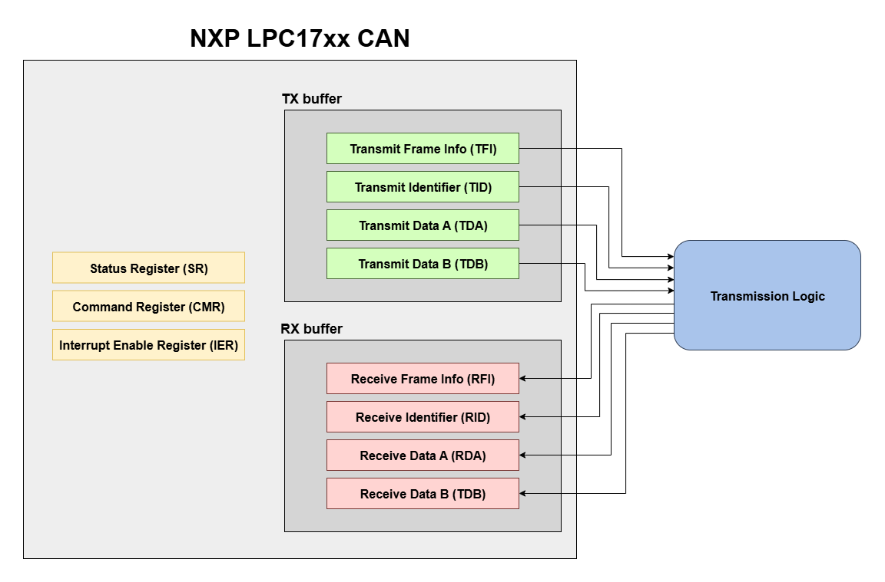

# CAN peripheral

- [Introduction](#introduction)
- [Qemu custom device](#qemu-custom-device)
  - [Create the `.c` and `.h` files](#create-the-c-and-h-files)
  - [Bus and Peripheral instantiation](#bus-and-peripheral-instantiation)
- [LPC17xx CAN Peripheral: description](#lpc17xx-can-peripheral-description)
  - [TX buffer](#tx-buffer)
  - [RX buffer](#rx-buffer)
  - [Status Register (SR)](#status-register-sr)
  - [Command Register (CMR)](#command-register-cmr)
  - [Interrupt Enable Register (IER)](#interrupt-enable-register-ier)
- [LPC17xx CAN peripheral: Operation \& implementation](#lpc17xx-can-peripheral-operation--implementation)
  - [Writing to TX buffer and starting a transmission](#writing-to-tx-buffer-and-starting-a-transmission)
  - [Transmitting](#transmitting)
  - [Receiving](#receiving)
  - [Reading from RX buffer](#reading-from-rx-buffer)


## Introduction

The **Controller Area Network** (**CAN**) is a shared bus communication protocol where all nodes (i.e CAN peripherals) receive frames transmitted on the bus. 


Unlike UART (point-to-point communication), CAN devices must connect to a **CAN bus** object. When one peripheral transmits, all others on the bus receive the frame.

## Qemu custom device

As with UART, building a custom Qemu device requires:

* Creating the `.c` and `.h` files for the device
* Modifying `meson.build` 
* Instantiating the device in the target board’s SoC

**NOTE**: in this case, with the CAN peripheral, we must also instanciate a BUS.

### Create the `.c` and `.h` files

In this specific case, `can.c` was created inside `qemu/hw/net/can` directory, and `can.h` inside `qemu/include/hw/net`. <br>
The `can.h` file contains, as for UART, the peripheral state (`CanState`) and some useful constants (mostly addresses of peripheral registers and masks for bits of such registers).

```c
struct CanState {
        SysBusDevice parent_obj;

        MemoryRegion mmio;

        //controller registers
        ...

        qemu_irq irq;   //interrupt

        CanBusClientState bus_client;
        CanBusState *canbus;
    };
```


As we can see, the peripheral state for a CAN device must include:

```c
CanBusClientState bus_client;
CanBusState *canbus;
```

This differs from UART, which instead stores a `CharBackend` for serial communication.


The `can.c` file contains the implementation of the peripheral and is structured similarly to the UART one, except that CAN needs explicit bus connection logic.

```c
static void check_and_set_interrupt(void *opaque){
    /* Check if an interrupt should be raised based on status and control bits */
}


static void check_and_clear_interrupt(void *opaque){
    /* Check if an interrupt should be cleared based on status and control bits */
}


static void set_status_bit(void *opaque, uint32_t status_bit){
    /* Set a specific status bit */
}


static void reset_status_bit(void *opaque, uint32_t status_bit){
    /* Reset a specific status bit */
}


static bool can_can_receive(CanBusClientState *client){
    /* Check if the CAN bus client can receive messages */
}


static ssize_t can_receive(CanBusClientState *client,
                               const qemu_can_frame *buf, size_t buf_size){
    /* Handle reception of a CAN frame and update device state registers */
}


static uint64_t can_read(void *opaque, hwaddr addr,
                                       unsigned int size){
    /* Read from CAN device registers and return read value*/
}


static void can_transmit(CanState *s) {
    /* Transmit a CAN frame from the device onto the bus */
}


static void can_write(void *opaque, hwaddr addr,
                                  uint64_t val, unsigned int size){
    /* Write a value to CAN device registers */
}


static void can_reset(DeviceState *dev){
    /* Reset the CAN device state and clear registers */
}

/* Info structure containing callbacks for CAN bus client */
static CanBusClientInfo can_bus_client_info = {
    .can_receive = can_can_receive,
    .receive = can_receive,
};


static int can_can_connect_to_bus(CanState *s,
                                          CanBusState *bus)
{
    /* Connect the CAN device to the bus and return success, or failure otherwise*/
}


static void can_realize(DeviceState *dev, Error **errp)
{
    /* Realize the CAN device (initialize and attach to bus if available) */
}

/* Memory-mapped I/O operations for the CAN device */
static const MemoryRegionOps can_ops = {
    .read = can_read,
    .write = can_write,
    .endianness = DEVICE_NATIVE_ENDIAN,
};

/* Properties of the CAN device */
static Property can_properties[] = {
    DEFINE_PROP_LINK("canbus", CanState, canbus, TYPE_CAN_BUS,
                     CanBusState *),
    DEFINE_PROP_END_OF_LIST(),
};


static void can_init(Object *obj)
{
    /* Initialize the CAN device object, IRQ, and memory region */
}


static void can_class_init(ObjectClass *klass, void *data)
{
    /* Initialize CAN device class (reset, properties, realize) */
}

/* TypeInfo definition for CAN device */
static const TypeInfo can_info = {
    .name          = TYPE_CAN,
    .parent        = TYPE_SYS_BUS_DEVICE,
    .instance_size = sizeof(CanState),
    .instance_init = can_init,
    .class_init    = can_class_init,
};

/* Register CAN device type */
static void can_register_types(void)
{
    type_register_static(&can_info);
}

type_init(can_register_types)
```

### Bus and Peripheral instantiation

Inside SoC `init`:

```c
//initialize the CANBUS
nxps32k3->canbus = CAN_BUS(object_new(TYPE_CAN_BUS));
object_property_add_child(OBJECT(nxps32k3),"canbus", OBJECT(nxps32k3->canbus));

//initialize the CAN peripheral(s)
object_initialize_child(oc, "can0", &nxps32k3->can0, TYPE_CAN);
```

Inside SoC `realize`:

```c
dev = DEVICE(&(s->can0));

object_property_set_link(OBJECT(&s->can0), "canbus", OBJECT(s->canbus), &error_fatal);

if (!sysbus_realize(SYS_BUS_DEVICE(&s->can0), errp)) {
    return;
}

busdev = SYS_BUS_DEVICE(dev);
sysbus_mmio_map(busdev, 0, can0_addr);
sysbus_connect_irq(busdev, 0, qdev_get_gpio_in(armv7m, can0_irq));

```


As with UART, you must define the peripheral base address (`can0_addr`) and interrupt number (`can0_irq`).


## LPC17xx CAN Peripheral: description

For the implementation of the peripheral, we chose the *NXP LPC17xx* CAN controller (see *Chapter 16* of the user manual at https://www.keil.com/dd/docs/datashts/philips/lpc17xx_um.pdf), because we had already used it in the Computer Architectures course. For this project, we made a customized, simplified version of it:

- **TX buffer** (4 registers):
  - **TFI**: Transmit frame Info (`0x00`)
  - **TID**: Transmit Identifier (`0x04`)
  - **TDA**: Transmit Data bytes 1-4 (`0x08`)
  - **TDB**: Transmit Data bytes 5-8 (`0x0C`)
- **RX buffer** (4 registers):
  - **RFI**: Receive Frame Info (`0x10`)
  - **RID**: Received Identifier (`0x14`)
  - **RDA**: Received Data bytes 1-4 (`0x18`)
  - **RDB**: Received Data bytes 5-8 (`0x1C`)
- **SR**: Status Register (`0x20`)
- **CMR**: Command Register (`0x24`)
- **IER**: Interrupt Enable Register (`0x28`)

The addresses in parentheses are offsets relative to the peripheral base address.





We need to describe the registers in detail, as knowing their topology is essential to understand how transmission and reception work:

### TX buffer

#### Transmit Frame Info (TFI) register
- Bit `15:0` $\rightarrow$ Reserved
- Bit `19:16` $\rightarrow$ **DLC** (Data Length Code): This value is sent in the DLC field of the next transmit message. In addition, if RTR = 0, this value controls the number of Data bytes sent in the next transmit
message, from the TDA and TDB registers, in this way:
  - [0000,0111] $\rightarrow$ 0 to 7 data bytes
  - [1000,1111] $\rightarrow$ 8 data bytes
- Bit `29:20` $\rightarrow$ Reserved
- Bit `30` $\rightarrow$ **RTR** (Remote Transmission Request): This value is sent in the RTR bit of the next transmit message. If this bit is 0, the number of
data bytes called out by the DLC field are sent from the TDA and TDB registers.
If this bit is 1, a Remote Frame is sent, containing a request for that number of bytes
- Bit `31` $\rightarrow$ **FF** (Frame Format):  If this bit is 0, the next transmit message will be sent with an 11-bit Identifier (standard frame
format), while if it’s 1, the message will be sent with a 29-bit Identifier (extended frame
format).

#### Transmit Identifier (TID) register
##### if TFI[FF] = 0 (standard frame format)
- Bit `10:0` $\rightarrow$ **ID** : The 11-bit identifier to be sent in the next transmit message
- Bit `31:11` $\rightarrow$ Reserved
##### if TFI[FF] = 1 (extended frame format)
- Bit `28:0` $\rightarrow$ **ID** : The 29-bit identifier to be sent in the next transmit message
- Bit `31:29` $\rightarrow$ Reserved


#### Transmit Data A (TDA) register
- Bit `7:0` $\rightarrow$ **DATA0**: Data byte 0 of the next transmit message
- Bit `15:8` $\rightarrow$ **DATA1**: Data byte 1 of the next transmit message
- Bit `23:16` $\rightarrow$ **DATA2**: Data byte 2 of the next transmit message
- Bit `31:24` $\rightarrow$ **DATA3**: Data byte 3 of the next transmit message

#### Transmit Data B (TDB) register
- Bit `7:0` $\rightarrow$ **DATA4**: Data byte 4 of the next transmit message
- Bit `15:8` $\rightarrow$ **DATA5**: Data byte 5 of the next transmit message
- Bit `23:16` $\rightarrow$ **DATA6**: Data byte 6 of the next transmit message
- Bit `31:24` $\rightarrow$ **DATA7**: Data byte 7 of the next transmit message

### RX buffer

#### Receive Frame Info (RFI) register
- Bit `15:0` $\rightarrow$ Reserved
- Bit `19:16` $\rightarrow$ **DLC** (Data Length Code): this field contains the Data Length Code (DLC) field of the current received message. When `RTR = 0`, this is related to the number of data bytes available in the RDA and RDS registers as follows:
  - [0000,0111] $\rightarrow$ 0 to 7 data bytes
  - [1000,1111] $\rightarrow$ 8 data bytes
<br> 

  with `RTR = 1`, this value indicates the number of data bytes requested to be sent back, with the same encoding.
- Bit `29:20` $\rightarrow$ Reserved
- Bit `30` $\rightarrow$ **RTR** (Remote Transmission Request): This bit contains the Remote Transmission Request bit of the current received message. 0
indicates a Data Frame, in which (if DLC is non-zero) data can be read from the RDA
and possibly the RDB register. 1 indicates a Remote frame, in which case the DLC
value identifies the number of data bytes requested to be sent using the same Identifier.
- Bit `31` $\rightarrow$ **FF** (Frame Format):  A 0 in this bit indicates that the current received message included an 11-bit Identifier, while a 1 indicates a 29-bit Identifier. This affects the contents of **RID** register

#### Receive Identifier (RID) register

Same as **TID**

#### Receive Data A (RDA) register

Same as **TDA**


#### Receive Data B (RDB) register
Same as **TDB**

### Status Register (SR) 
- Bit `0` $\rightarrow$ **RBS** (Receive Buffer Status): 
	- 0 (empty): no message available
	- 1 (full): at least one complete message is received by the RX buffer (RDA and RDB) <br>

  **NOTE**: this bit is set to 0 when data in RX buffer is read
- Bit `1` $\rightarrow$ **DOS** (Data Overrun Status):  
	- 0 (absent): No data overrun has occurred 
	- 1 (overrun): a message was lost because the preceding message to this CAN controller was not read and released quickly enough 
- Bit `2` $\rightarrow$ **TBS** (Transmit Buffer Status): 
	- 0 (locked): the transmit buffer is not available for transmission, because a previously queued message for this CAN controller has not yet been sent, therefore sofware should not write to TFI, TID, TDA, TDB.
	- 1 (released): the transmit buffer is available to the CPU. No transmit message is pending for this CAN controller, and software may write to TFI, TID, TDA and TDB registers
- Bit `3` $\rightarrow$ **TCS** (Transmit Complete Status): 
	- 0 (incomplete): the requested transmission has not been succesfully completed
	- 1 (complete): the requested transmission has been succesfully completed
- Bit `31:4` $\rightarrow$ Reserved


### Command Register (CMR)

- Bit `0` $\rightarrow$ **TR** (Transmission Request): 
  - 0 (absent): no effect
  - 1 (absent): when this bit is written to 1, the message in the TX buffer (TFI, TID, TDA, TDB) is queued for transmission. This bit is automatically cleared by hardware after the transmission request has been accepted
- Bit `2` $\rightarrow$ **RRB** (Release Receive Buffer): 
  - 0 (no action): do not release the receive buffer
  - 1 (released): the information in the Receive Buffer (RFI, RID, RDA, RDB) is released and the RBS bit in the SR register is cleared to 0. This bit is automatically cleared by hardware after the receive buffer has been released
- Bit `3` $\rightarrow$ **CDO** (Clear Data Overrun): 
  - 0 (no action): do not clear the DOS bit in the SR register
  - 1 (clear): the DOS bit in the SR register is cleared to 0. This bit is automatically cleared by hardware after the DOS bit has been cleared
- Bit `31:4` $\rightarrow$ Reserved

### Interrupt Enable Register (IER)

- Bit `0` $\rightarrow$ **RIE** (Receive Interrupt Enable): an interrupt is generated when RBS bit in the SR register is set to 1
- Bit `1` $\rightarrow$ **TIE** (Transmit Interrupt Enable): an interrupt is generated when TCS bit in the SR register is set to 1
- Bit `2` $\rightarrow$ Reserved
- Bit `3` $\rightarrow$ **DOIE** (Data Overrun Interrupt Enable): an interrupt is generated when DOS bit in the SR register is set to 1
- Bit `31:4` $\rightarrow$ Reserved


## LPC17xx CAN peripheral: Operation & implementation

The CAN state for our implementation is the following:

```c
 struct CanState {
        SysBusDevice parent_obj;

        MemoryRegion mmio;

        uint32_t ext_clk_freq;

        //controller registers
        uint32_t tfi;
        uint32_t tid;
        uint32_t tda;
        uint32_t tdb;
        uint32_t rfi;
        uint32_t rid;
        uint32_t rda;
        uint32_t rdb;
        uint32_t sr;
        uint32_t cmr;
        uint32_t ier;

        qemu_irq irq;   //interrupt

        CanBusClientState bus_client;
        CanBusState *canbus;
    };
```

### Writing to TX buffer and starting a transmission

The information to be transmitted is always first written to the TX buffer registers: `TFI`, `TID`, `TDA`, `TDB`. <br>

Thanks to the setup memory mapping, writing to the CAN device means writing to its registers. The peripheral registers are memory-mapped at the peripheral base address, so we can define them as follows:

```c
#define CAN0_ADDRESS    ( 0x40304000UL )

#define CAN0_TFI    ( *( ( ( volatile uint32_t * ) ( CAN0_ADDRESS + 0UL ) ) ) )
#define CAN0_TID    ( *( ( ( volatile uint32_t * ) ( CAN0_ADDRESS + 4UL ) ) ) )    
#define CAN0_TDA    ( *( ( ( volatile uint32_t * ) ( CAN0_ADDRESS + 8UL ) ) ) )
#define CAN0_TDB    ( *( ( ( volatile uint32_t * ) ( CAN0_ADDRESS + 12UL ) ) ) )
#define CAN0_RFI    ( *( ( ( volatile uint32_t * ) ( CAN0_ADDRESS + 16UL ) ) ) )
#define CAN0_RID    ( *( ( ( volatile uint32_t * ) ( CAN0_ADDRESS + 20UL ) ) ) )
#define CAN0_RDA    ( *( ( ( volatile uint32_t * ) ( CAN0_ADDRESS + 24UL ) ) ) )
#define CAN0_RDB    ( *( ( ( volatile uint32_t * ) ( CAN0_ADDRESS + 28UL ) ) ) )
#define CAN0_SR     ( *( ( ( volatile uint32_t * ) ( CAN0_ADDRESS + 32UL ) ) ) )
#define CAN0_CMR    ( *( ( ( volatile uint32_t * ) ( CAN0_ADDRESS + 36UL ) ) ) )
#define CAN0_IER    ( *( ( ( volatile uint32_t * ) ( CAN0_ADDRESS + 40UL ) ) ) )
```

Such definitions are found inside `NXP_Startup/can.h` file. <br>
An example of writing to the TX buffer registers is:

```c    
    CAN0_TID = (uint32_t) 0x123;
    uint8_t dlc = 3;
    CAN0_TFI = (uint32_t) ((dlc & 0xF) << DLC_POS);
    CAN0_TDA = (uint32_t) 0x03020100;
    CAN0_TDB = (uint32_t) 0x07060504;

```

Each of this writes triggers the execution of the function `can_write`, implemented in `can.c`, which updates the corresponding field in the `CanState` struct:

```c
static void can_write(void *opaque, hwaddr addr,
                                  uint64_t val, unsigned int size){
    CanState *s = (CanState*) opaque;

    switch (addr) {
        case TFI:
            s->tfi = (uint32_t) val;    //write val in tfi
            break;
        case TID:
            s->tid = (uint32_t) val;   //write val in tid
            break;
        case TDA:
            s->tda = (uint32_t) val;    //write val in tda
            break;
        case TDB:
            s->tdb = (uint32_t) val;    //write val in tdb
            break;
        case TDB:
            s->tdb = (uint32_t) val;    //write val in tdb
            break;
        case RFI:
            //read-only
            break;
        case RID:
            //read-only
            break;
        case RDA:
            //read-only
            break;
        case RDB:
            //read-only
            break;
        case SR: 
            //read-only
            break;
        case CMR:
            if (val & RRB) {   //Release Receive Buffer
                reset_status_bit(s, RBS);   //clear Receive Buffer Status
                s->cmr &= ~RRB;  //clear Release Receive Buffer
            }
            if (val & CDO) {   //Clear Data Overrun
                reset_status_bit(s, DOS);   //clear Data Overrun Status
                s->cmr &= ~CDO;  //clear Clear Data Overrun
            }
            if (val & TR) {    //Transmission Request
                s->cmr &= ~TR;   //clear Transmission Request
                reset_status_bit(s, TCS);   //Clear Transmit Complete Status
                can_transmit(s);
            }
            break;
        case IER:
            s->ier = (uint32_t) (val & 0x0F); //only the first 4 bits are used
            check_and_set_interrupt(s);
            check_and_clear_interrupt(s);
            break;
    }
    
    return;
}
```

then writing `1` to the `TR` bit of the `CMR` register starts the transmission:

```c
CAN0_CMR = (uint32_t) TR;
```

by calling function `can_transmit(s)`.

**NOTE**: In the real LPC17xx peripheral, the assertion of `TR` bit only queues the message for transmission, since the transceiver may be busy with a previous transmission, and also there are multiple TX buffers competing for bus access. <br> But in Qemu, the transmission is immediate and moreover, we only use one TX buffer, therefore as soon as we make a transmission request, the transmission starts.


### Transmitting

In a transmission, **`dlc` bytes** (`dlc` is specified in the `DLC` field of the `TFI` register and is capped at **8**) of data are sent from `TDA` and `TDB` registers. When `RTR = 1` (`RTR` is specified in `TFI`), `dlc` is set to `0` as no data bytes should be sent, since the transmission is a **remote request for data**. 

The **transmission identifier**, taken from the `TID` register, is either masked with **11** bits (**standard** frame format) or **29** bits (**extended** frame format), depending on whether the value of the `FF` bit is **0** or **1**, respectively.


In our implementation, in a transmission, data is packed into a `qemu_can_frame` struct and sent via the CAN bus object.
Frames follow this structure:

```c
typedef struct qemu_can_frame {
    qemu_canid_t can_id;
    uint8_t      can_dlc;
    uint8_t      flags;
    uint8_t      data[64] QEMU_ALIGNED(8);
} qemu_can_frame;
```
`can_id` contains the identifier (with `RTR` and `FF` flags, at the same position as in the `TFI` register), `can_dlc` contains the number of data bytes, `flags` is unused in our implementation, and `data` is an array of up to 64 bytes (only the first `can_dlc` bytes are relevant).

As mentioned before, the `can_transmit` function handles the transmission:

```c
static void can_transmit(CanState *s) {

    //initialize variables
    qemu_canid_t can_id = (qemu_canid_t) 0;
    uint8_t can_dlc = 0;

    can_id |=  s->tfi & RTR;   //write RTR flag in can_id
    can_id |= s->tfi & FF;    //write FF flag in can_id

    //the ID written in TID is masked according to the frame format (standard or extended)
    if (s->tfi & FF) {
        can_id |= s->tid & IDS;    //standard frame format
    } else {
        can_id |= s->tid & IDE;    //extended frame format
    }

    //get DLC from TFI only if RTR=0 (data frame), otherwise DLC is 0
    if (!(s->tfi & RTR)) 
        can_dlc = (uint8_t) ((s->tfi & DLC_MASK) >> DLC_POS); //DLC   


    qemu_can_frame frame = {
        .can_id = can_id,
        .can_dlc = can_dlc,
        .flags = 0x00,
    };

    
    for (int i=0; i<can_dlc && i<8;i++) {
        if (i<4) {
            frame.data[i] = (s->tda >> i*8) & 0xFF;
        } else {
            frame.data[i] = (s->tdb >> (i-4)*8) & 0xFF;
        }
    }

    can_bus_client_send(&s->bus_client, &frame, 1);

    //update status bits
    set_status_bit(s, TCS);  //set Transmit Complete Status (TCS) bit in SR register
}
```

Once transmission is complete, the `TCS` (Transmit Complete Status) bit in the `SR` register is set to `1`. If the `TIE` (Transmit Interrupt Enable) bit in the `IER` register is also set to `1`, an interrupt is generated.

### Receiving

The transmitted frame is received by every other CAN device connected to the bus, because every device has its `can_receive` callback triggered upon transmission, with the transmitted frame as argument:

```c
static ssize_t can_receive(CanBusClientState *client,
                               const qemu_can_frame *buf, size_t buf_size){
    
    CanState *s = container_of(client, CanState,
                                         bus_client);

    //copy values from the received frame into local variables
    const qemu_can_frame *frame = buf;

    qemu_canid_t can_id = frame->can_id;
    uint8_t can_dlc = frame->can_dlc;
    uint8_t data[64];
    memcpy(data, frame->data, sizeof(data));


    //set status bits
     if (s->sr & RBS) {
        //RX buffer was occupied -> Data Overrun Error
        set_status_bit(s, DOS);  //set DOS (Data Overrun Status) bit in SR register
    }


    //transfer received data to the proper registers

    //RID (Received ID)
    s->rid = (can_id & QEMU_CAN_EFF_MASK);

    //RFI (Received Frame Info)
    s->rfi = (can_id & QEMU_CAN_EFF_FLAG)  | (can_id & QEMU_CAN_RTR_FLAG) | ((can_dlc << DLC_POS) & DLC_MASK);

    //RDA and RDB (Received Data A and Received Data B)
    s->rda = 0x00000000;
    s->rdb = 0x00000000;

    for (int i=0; i<can_dlc && i<8;i++) {
        if (i<4) {
            s->rda |= (data[i] << i*8); 
        } else {
            s->rdb |= (data[i] << ((i-4)*8));
        }
    }

    //set status bits
    set_status_bit(s, RBS);  //a message is received by RX buffer and ready to be read
     
    return 0;
}
```
As we may notice, if the `RBS` (**Receive Buffer Status**) bit in the `SR` register is already set to `1` when a new frame is received, it means that the RX buffer was not released before receiving the new frame, therefore a **Data Overrun Error** occurs and the `DOS` (**Data Overrun Status**) bit in the `SR` register is set to `1`. If the `DOIE` (**Data Overrun Interrupt Enable**) bit in the `IER` register is set, this event will raise an interrupt. <br>
Then, the received data is copied into the **RX buffer** registers: `RID`, `RFI`, `RDA`, `RDB`, and finally the `RBS` bit in the `SR` register is set to `1`, signalling that the RX buffer has new information to be read. If the `RIE` (**Receive Interrupt Enable**) bit in the `IER` register is also set to `1`, an interrupt is generated. <br>
`RBS` bit isn't cleared until we don't write `1` to the `RRB` (**Release Receive Buffer**) bit of the `CMR` register. Similarly, for clearing a data overrun error, we must write `1` to the `CDO` (**Clear Data Overrun**) bit of the `CMR` register.


### Reading from RX buffer

In our SoC we instanciated two CAN peripherals: `CAN0` and `CAN1`. <br>
As we transmitted a frame with `CAN0` in the example above, we are now going to read it with `CAN1`. <br>

Reading a received transmission means reading the four registers: RFI, RID, RDA, RDB:

```c
  uint32_t rda = CAN1_RDA;
  uint32_t rdb = CAN1_RDB;
  uint32_t rid = CAN1_RID;
  uint32_t rfi = CAN1_RFI;
```
each of those reads triggers the execution of the function `can_read`, implemented in `can.c`, which reads the corresponding field in the `CanState` struct:

```c
static uint64_t can_read(void *opaque, hwaddr addr,
                                       unsigned int size){
    CanState *s = (CanState*) opaque;

    uint32_t retvalue = 0;

    switch (addr) {
        case TFI:
            //write-only
            break;
        case TID:
            //write-only
            break;        
        case TDA:
            //write-only
            break;
        case TDB:   
            //write-only
            break;
        case RFI:
            retvalue = s->rfi; //return value of RFI register
            break;
        case RID:
            retvalue = s->rid; //return value of RID register
            break;
        case RDA:
            retvalue = s->rda; //return value of RDA register
            break;
        case RDB:
            retvalue = s->rdb; //return value of RDB register
            break;
        case SR: 
            retvalue = s->sr;
            break;
        case CMR:
            retvalue = s->cmr;
            break;
        case IER:
            retvalue = s->ier;
            break;
    }

    return (uint64_t) retvalue; //MemoryRegionOps expects uint64_t
}
```
