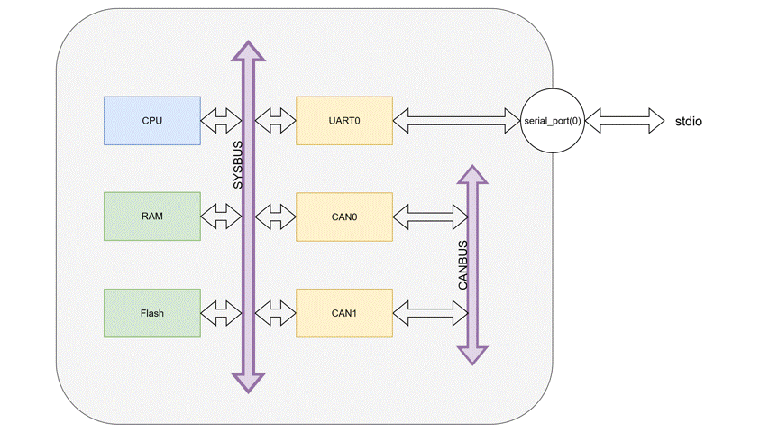

# FreeRTOS Example Application

We decided to write a simple FreeRTOS application which is able to use both the CAN and the UART peripherals.
The UART is the board's interface with `stdio`, so it is used to collect data from stdin and write data to stdout.
CAN0 and CAN1 peripherals are connected to the CAN bus. To test their correct behaviour, data is passed to CAN0 and transmitted to CAN1 using the CANBUS.
Finally, data is collected from CAN1 and printed back to stdout.

### UART0 receives chars from stdin

```c
UART_printf("Reading 8 chars...\n");

//read from UART
for(int i=0; i<8; i++){
    characters[i] = UART_getchar();
}
```

### Data received by UART is sent to CAN0

```c
//read from UART
for(int i=0; i<8; i++){
    characters[i] = UART_getchar();
}
```

```c
//write to CAN
int can_id = 0x123;
int can_dlc = 8;
int is_extended_id = 1;
int is_remote_frame = 0;

//can_data = characters
CAN_write(0, can_id, characters, can_dlc,
          is_extended_id, is_remote_frame);
```

### CAN0 transmits to CAN1 using the CANBUS

```
CAN_transmit(0);	//Use CAN0 to transmit
```

### Data received by CAN1 is sent to UART0

```c
while(!CAN_has_received(1)){}
		
CAN_read_data(1, characters2);
CAN_release_receive_buffer(1);

```

### UART0 transmit characters to stdout

```c
sprintf(str, "%s\n", characters2);
UART_printf(str);
```

## Implementation details
To perform the above mentioned operations, 4 tasks are created with the same priority. They are controlled by 4 binary semaphores which allow the execution of a task only if the preceding task has already completed its duty. 
```c
if((xSem1 = xSemaphoreCreateBinary())==NULL){
    UART_printf("Semaphore creation failed\n");
}
if((xSem2 = xSemaphoreCreateBinary())==NULL){
    UART_printf("Semaphore creation failed\n");
}
if((xSem3 = xSemaphoreCreateBinary())==NULL){
    UART_printf("Semaphore creation failed\n");
}
if((xSem4 = xSemaphoreCreateBinary())==NULL){
    UART_printf("Semaphore creation failed\n");
}
//xSem1 is free to be taken
xSemaphoreGive(xSem1);

UART_init();

xTaskCreate(read_from_UART, "Task1", 1000, 
                NULL, mainTASK_PRIORITY, NULL);
xTaskCreate(write_to_CAN_and_transmit, "Task2", 1000, 
                NULL, mainTASK_PRIORITY, NULL);
xTaskCreate(read_from_CAN, "Task3", 1000, 
                NULL, mainTASK_PRIORITY, NULL);
xTaskCreate(write_to_UART, "Task4", 1000, 
                NULL, mainTASK_PRIORITY, NULL);

```

The `UART_init` and `CAN_init` functions activate the peripherals corresponding interrupts.

Each peripheral has its own **interrupt handler**, that is the function executed when the corresponding interrupt is raised:

```c
void Uart_Handler( void ){
	UART_clear_interrupt();
	UART_printf("UART: Interrupt received\n");
}

void CAN0_Handler(void){
	CAN_clear_interrupt(0);
	UART_printf("CAN: Interrupt received\n");
}

void CAN1_Handler(void){
	CAN_clear_interrupt(1);
	UART_printf("CAN: Interrupt received\n");
}
```

## Example execution

