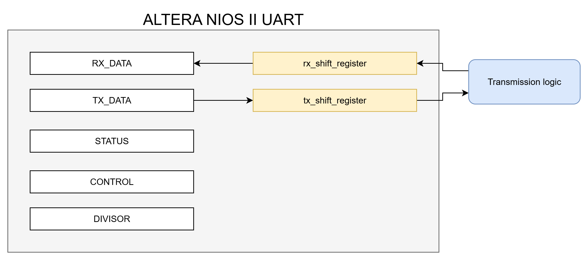
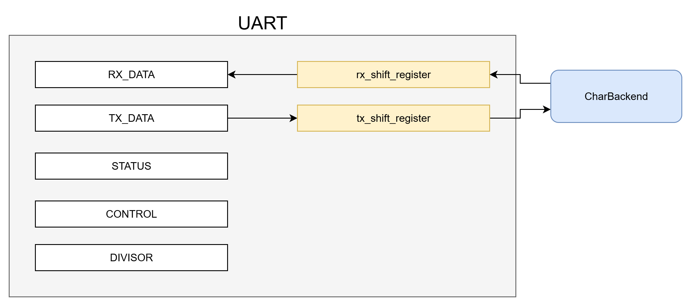

# Qemu UART

- [Introduction](#introduction)
- [Qemu custom device](#qemu-custom-device)
- [Altera Nios II UART Peripheral](#altera-nios-ii-uart-peripheral)
- [Chardev in Qemu](#chardev-in-qemu)
  - [Reception using a CharBackend](#reception-using-a-charbackend)
  - [Transmission using a CharBackend](#transmission-using-a-charbackend)
- [Emulation of UART behaviour in Qemu](#emulation-of-uart-behaviour-in-qemu)
  - [Reading from serial port](#reading-from-serial-port)
  - [Writing in TX\_DATA](#writing-in-tx_data)
  - [Writing in DIVISOR](#writing-in-divisor)
  - [Status bits](#status-bits)
  - [Control bits](#control-bits)
- [Kernel](#kernel)
  - [Read](#read)
  - [Write](#write)


## Introduction
Qemu allows the emulation of a custom device which can be instantiated on a board and used in a simulation. To have the board communicate with the external world, a character device is needed.
The UART is a serial device used for point to point full duplex communication. It transmits one bit at a time following the UART protocol:
* The serial line is left HIGH (1) when no transmission occurs.
* **Start Bit**: it starts the transmission by driving the line LOW (0).
* **Data bits**: the actual information trasmitted. Usually 8, they are transmitted LSB first.
* **Parity bit**: it is used for error detection. Parity can be ODD or EVEN.
* **Stop bit**(s): one or two bits which drive the line HIGH, signalling the end of the transmission.

As we are not building the UART on hardware but we are just emulating the peripheral in software, we don't really care about how the single bits are transmitted. 
Qemu provides a backend chardev configurable with the number of data and stop bits, type of parity and baudrate.
What are interested in how the peripheral can receive or transmit characters and how the status bits change accordingly.

## Qemu custom device
As we are building a custom Qemu device, we need to:
*  Create the .c and .h files of the custom device
*  Modify meson.build and KConfig files to let Qemu build the new device
*  Instantiate the custom device on a target board, which will be used during the simulation
*  Modify KConfig of the custom board

#### Create the .c and .h files

In this specific case, uart.c was created inside hw/char directory. As a consequence, uart.h was created inside include/hw/char.

The .h file contains
```c
#ifndef UART_H
#define UART_H

    #include "qom/object.h"
    #include "hw/sysbus.h"
    ...
    
    #define TYPE_UART "uart"
    OBJECT_DECLARE_SIMPLE_TYPE(UartState, UART)
    
    /*Define also the addresses of registers*/
    
    struct UartState {
        /*This State struct is the key item which contains all the 
         internal data structures and the connections with the 
         System Bus*/
    
        SysBusDevice parent_obj;
        MemoryRegion mmio;

        uint32_t reg1;
        uint32_t reg2;  //they can be viewed from outside
                        //with the addresses previously specified
        ...

        CharBackend chr;    //because it is a chardev
    };

#endif
```
The .c file is structured in the following way:
```c
static void uart_reset(DeviceState *dev)
{
    /*Resets the device*/
}

static void uart_realize(DeviceState *dev, Error **errp)
{
    /*Instantiates the device*/
}

static const MemoryRegionOps uart_ops = {
    /*connects the device operations with the corresponding 
    functions, just like "struct file_operations fops" 
    in a linux device driver*/
};

static Property uart_properties[] = {
    /* Tells Qemu that the custom device is a chardev */
    DEFINE_PROP_CHR("chardev", UartState, chr),
};

static void uart_init(Object *obj)
{
    /*Initializes the custom device*/
}

static void uart_class_init(ObjectClass *klass, void *data)
{
    /*Initializes the device class, specifying the realize and reset functions 
    so that they can be invoked by Qemu*/
    
    DeviceClass *dc = DEVICE_CLASS(klass);

    device_class_set_props(dc, uart_properties);
    device_class_set_legacy_reset(dc, uart_reset);
    dc->realize = uart_realize;
}

static const TypeInfo uart_info = {
    .name          = TYPE_UART,
    .parent        = TYPE_SYS_BUS_DEVICE,
    .instance_size = sizeof(UartState),
    .instance_init = uart_init,
    .class_init    = uart_class_init,
};

static void uart_register_types(void)
{
    type_register_static(&uart_info);
}

type_init(uart_register_types)
```

The just mentioned functions are the boilerplate of basically every Qemu device.


## Altera Nios II UART Peripheral
There are many different implementations of the UART peripheral. We chose the Altera Nios II version because we had the opportunity to use it and test its behaviour in the Electronics for Embedded Systems course, taught by Prof. Claudio Passerone.

The UART protocol parameters cannot be configured, except for the baudrate. It is a 8E1 UART transmission (8 data bits, EVEN parity bit, 1 single stop bit).

Five 32-bit registers are present:
* RXDATA (0x00)
* TXDATA (0x04)
* STATUS (0x08)
* CONTROL (0x0C)
* DIVISOR (0x10)

The addresses shown are the ones relative to the UART peripheral base address.

Data coming from outside is sampled bit by bit by rx_shift_register. When a full byte is sampled, all bits are transferred in parallel to the RXDATA register.
Data being transmitted outside is first moved from TXDATA to tx_shift_register (in parallel), which is in charge of transmitting the character one bit at a time to the serial line. 
The transmitter and receiver logic deal with parity check, start and stop bits insertion and removal.



The STATUS register contains status bits which can be set or reset when certain conditions hold.
The status bits are:
* **PE** (bit 0): parity error
* **FE** (bit 1): frame error
* **BRK** (bit 2): break error
* **ROE** (bit 3): receive overrun error
* **TOE** (bit 4): transmit overrun error
* **TMT** (bit 5): transmit empty
* **TRDY** (bit 6): transmit ready
* **RRDY** (bit 7): receive ready
* **E** (bit 8): generic error

Error bits set to 1 should be cleared by the processor.

The CONTROL register enables interrupts for the corresponding status bit.
For instance, if IROE = 1 (bit 3 of CONTROL) the corresponding interrupt is activated when ROE = 1 (bit 3 of STATUS).

## Chardev in Qemu
In Qemu there exist some APIs for character devices.
A **Character Backend** can be instantiated and deals with the transmission and reception of a character from outside. In this way we can just focus on implementing a nice frontend.

### Reception using a CharBackend
* The backend receives a character from outside, stores it in an internal buffer and then it is ready to send it to the frontend
* The frontend must first tell the backend that it is ready to receive a new char, calling `qemu_chr_fe_accept_input(&s->chr)`
* Before transmitting the char, the backend performs another check: it calls `uart_can_receive` function which will tell how many characters the frontend is willing to receive
* When a positive number is returned, the backend can send its data to the frontend, calling the `uart_receive` function.

### Transmission using a CharBackend
* When the frontend wants to send data to the backend, it calls `qemu_chr_fe_write_all(&s->chr, &ch, 1)`.

The backend can be configured with the UART parameters:
```c
QEMUSerialSetParams ssp;
    
s->baudrate = s->clk_freq / (s->divisor+1);     
ssp.speed = s->baudrate;

//UART 8E1 with configurable baudrate
ssp.parity = 'E';
ssp.data_bits = 8;
ssp.stop_bits = 1;

// start, data, parity, stop bits
s->frame_size = 1 + ssp.data_bits + 1 + ssp.stop_bits;  

qemu_chr_fe_ioctl(&s->chr, CHR_IOCTL_SERIAL_SET_PARAMS, &ssp);
```
`&s->chr` is the pointer to the character backend.

## Emulation of UART behaviour in Qemu
Even though the CharBackend is configurable with the baudrate, the transmission of a char occurs instantaneously.
To achieve the UART behaviour, timers were used.
`uart_can_receive` check was not needed anymore, so it always returns 1.

Let's start from scratch.
The UART state is the following:
```c
struct UartState {
        SysBusDevice parent_obj;
        QEMUTimer *rx_timer;
        QEMUTimer *tx_timer;
        MemoryRegion mmio;

        uint8_t can_receive;    //internal state variable

        uint64_t clk_freq;
        uint64_t baudrate;
        uint64_t char_tx_time;
        int frame_size;

        uint32_t rxdata;    //read-only
        uint32_t txdata;    //write-only
        uint32_t status;    //read-write
        uint32_t control;   //read-write
        uint32_t divisor;   //read-write

        uint8_t tx_shift_register;
        uint8_t rx_shift_register;

        CharBackend chr;
    };
```
The device includes 2 virtual timers, some internal variables, 5 registers accessible from outside and the 2 registers hidden from outside that will act as the two shift registers of the Altera Nios II UART peripheral. They won't actually behave as shift registers, but they will emulate the timing needed for a complete character transmission. For simplicity, they will be called rx_shift_register and tx_shift_register.

This is the structure of the peripheral:



            
Now, let's go through every UART operation one by one.

### Reading from serial port

#### Backend → rx_shift_register

##### Scenario 1
A new character has been sampled by the backend and rx_shift_register is ready.
* `qemu_chr_fe_accept_input` was already called by the frontend
* `uart_receive` is executed
    * rx_shift_register is empty
        * rx_shift_register is filled with the new char
        * a timer of char_tx_time is set
        * `qemu_chr_fe_accept_input` is called

##### Scenario 2
A new character has been sampled by the backend and rx_shift_register is not ready.
* `qemu_chr_fe_accept_input` was already called by the frontend
* `uart_receive` is executed
    * rx_shift_register is NOT empty
    * nothing else happens, but the character stored in the backend buffer is lost
    
NOTE: this scenario is not realistic, as the peripheral assumes that the transmitter is sending characters at a defined baudrate. The transmission of a new character cannot start before the previous character has been completely transmitted. 
It is the transmitter's duty to create a queue and send characters one by one at the serial port at the defined pace.

#### rx_shift_register → RX_DATA

##### Scenario 1
A character is in rx_shift_register waiting for the timer to expire. RX_DATA is ready.
* Timer expires
    * RX_DATA is filled with rx_shift_register's content
    * RRDY status bit is set to 1

##### Scenario 2
A character is in rx_shift_register waiting for the timer to expire. RX_DATA is NOT ready.
* timer expires
    * RX_DATA is filled with rx_shift_register's content (the old content is overwritten and lost)
    * RRDY status bit was already 1
    * ROE status bit is set to 1 
        * E status bit is set to 1


### Writing in TX_DATA

#### TX_DATA → tx_shift_register

##### Scenario 1
A character was written inside TX_DATA. tx_shift_register is ready.
* tx_shift_register is filled with TX_DATA's content
    * status bit TMT is set to 0 (tx_shift_register is busy)
    * status bit TRDY is set to 1 (TX_DATA can receive new data)
    * a timer of char_tx_time is set
* timer expires
    * status bit TMT is set to 1 (tx_shift_register can host new data)

##### Scenario 2
A character was written inside TX_DATA. tx_shift_register is NOT ready.
* Status bit TRDY is set to 0
* Timer expires (tx_shift_register was not ready, so there was an active timer)
    * tx_shift_register is filled with TX_DATA's content
        * status bit TMT is set to 0 (tx_shift_register is busy)
        * status bit TRDY is set to 1 (TX_DATA can receive new data)
        * a timer of char_tx_time is set

##### Scenario 3
A character was written inside TX_DATA and a new character is written before the old was processed. tx_shift_register is NOT ready.
* Status bit TRDY was 0
    * status bit TOE is set to 1
        * status bit E is set to 1
* Timer expires (tx_shift_register was not ready, so there was an active timer)
    * tx_shift_register is filled with TX_DATA's new content (old content is lost)
        * status bit TMT is set to 0 (tx_shift_register is busy)
        * status bit TRDY is set to 1 (TX_DATA can receive new data)
        * a timer of char_tx_time is set

#### tx_shift_register → backend

##### Scenario
A timer was active as tx_shift_register is not ready.
* timer expires
    * `qemu_chr_fe_write_all` is called and the backend transmits the character in the serial port

**NOTE_1**: "ready" register means that its content was already read and hence can be safely overwritten.
**NOTE_2**: checks on "readiness" are performed using either status bits or internal variables. In particular:
* rx_shift_register is ready when `s->can_receive = 1`
* RX_DATA is ready when `RRDY = 1`
* tx_shift_register is ready when `TMT = 1`
* TX_DATA is ready when `TRDY = 1`

### Writing in DIVISOR
Writing a new value in DIVISOR leads to a different character transmission time:
```
s->baudrate = s->clk_freq / (s->divisor+1);
s->char_tx_time = (NANOSECONDS_PER_SECOND / s->baudrate) * s->frame_size;
```
(these lines of code are inside `update_params` function)

Timers will last for a different time interval, accordingly.

### Status bits
Status bits are set/reset during the peripheral execution. 
Error bits can only be set by the peripheral (not reset) and must be cleared by the processor.
Status bits regarding the serial transmission (PE, FE, BRK) are always at 0, as we don't control it.

### Control bits
Setting a control bit to 1 implies that when the corresponding bit in the status register is set to 1 an interrupt is raised.
As there is a single interrupt associated to the UART, it is raised if any of the products `CONTROL[i]` * `STATUS[i]` returns 1.

## Kernel

### Read
Reading the UART is essentially just an access to the value contained inside a register.
If the kernel executes the following code, a read operation is triggered:
```c
volatile uint32_t *const UART_RXDATA = UART_BASE + 0;

uint32_t ptr = UART_RXDATA;
uint32_t ch = *ptr;
```

### Write
Writing in the UART is equivalent to writing a value inside a register.
If the kernel executes the following code, a write operation is triggered:
```c
volatile uint32_t *const UART_TXDATA = UART_BASE + 4;

uint32_t ptr = UART_TXDATA;
*ptr = 'A';
```